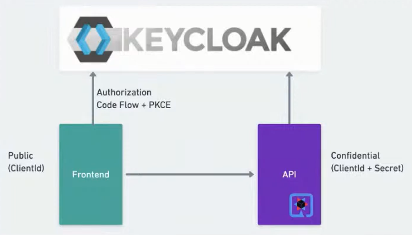

# quarkus-keycloak project
Este projeto é feito usando Quarkus.

Se quiser aprender mais sobre o Quarkus visite o site:  https://quarkus.io/ 


### Visão Geral:
Este projeto demo possui componentes abaixo,os principais são um frontEnd e um backEnd e ambos se conectam no Keycloak:

* Front: Página Web em Html com cliente público conectando no KeyCloak
* BackEnd: Uma API RestFull Quarkus e conectando no Keycloak via cliente privado.
* Keycloak: Criado um Reaml Keycloak com o nome meetup e dois usuários (user1 e user2) e duas roles (user e admin) respectivamente associado a cada usuário.
* Ngnix: Um balanceador serve o conteúdo estático do frontEnd(html) e balanceador para a APi e o KeyCloak.
* Mysql: Banco de dados para salvar os schema do Keycloak.

<br/>
Abaixo possui o desenho da solução demo do projeto.



<br/>

Requitos para executar o projeto:
 * Docker versão 20 ou superior  https://www.docker.com/products/docker-desktop/

<br/>

### Subindo o projeto:
O processo de subir demorar alguns minutos, devido se ter colocado o build [Dockerfile](quarkus-rest-app/Dockerfile.jvm) da backend Quarkus dentro da imagem docker para que não precise do Java e Maven instalado no computador para testar a demo.

<br/>


Execute o comando abaixo e depois acesse a URL http://gateway.docker.internal
```shell
 docker-compose up  --remove-orphans
```

<br/>

#### Tela do FrontEnd


Onde temos opções de login, mostrar token e logout e o envio do token para API.

Dados Login do realm Meetup:
* Usuário: user1 e senha: user1  perfil/role: user
* Usuário: user2 e senha: user2  perfil/role: admin

<br/>

#### Detalhamento do EndPoints
* Url FronEnd: http://gateway.docker.internal
* Url KeyCloak (usuário: admin e senha: password): http://gateway.docker.internal/admin  
* API BackEnd:
  * Url Publica: http://gateway.docker.internal/api/public/
  * Apenas com a Role: user
    *  http://gateway.docker.internal/api/users/
  * Apenas com a Role: admin
    * http://gateway.docker.internal/api/admins/
  * Com qualquer uma das Roles: admin ou user
      * http://gateway.docker.internal/api/users_admins/
  * Autenticado no Keycloak e não valida a nenhuma role:
    * http://gateway.docker.internal/api/authenticated/

     
<br/>

### Material de apoio como escolher o tipo do fluxo de autorização:


